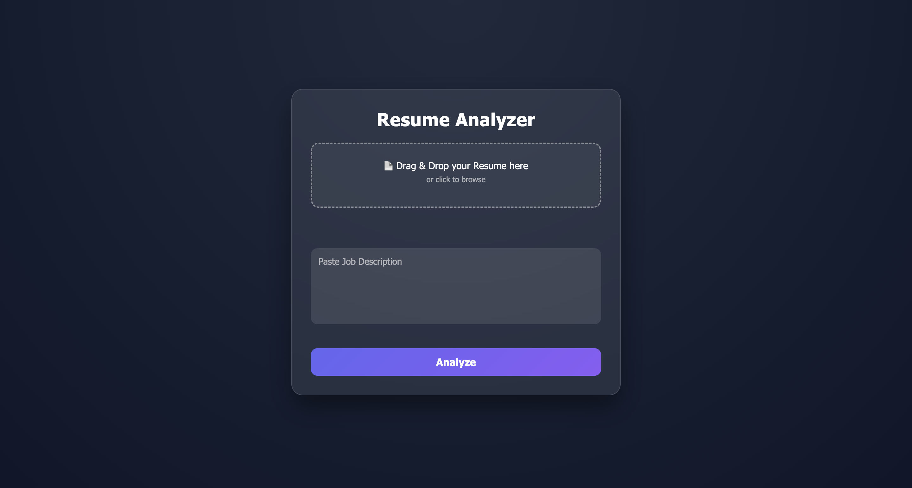
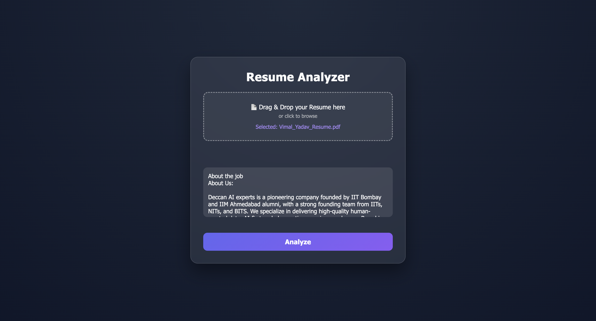
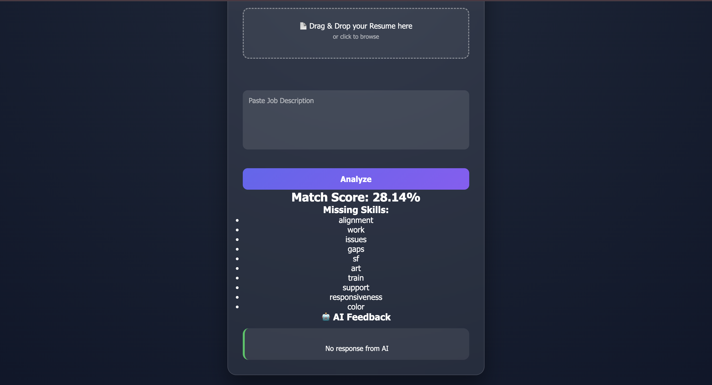

# <div align="center"> AI Resume Analyzer</div>

<div align="center">

### ⚡ Smart ATS Scoring System Powered by Gemini AI


<br><br>

[](https://resume-analyzer-3l6y.onrender.com)

</div>

---

## 🌟 About Project

**AI Resume Analyzer** is an intelligent web application that evaluates resumes against job descriptions and helps candidates improve their chances of passing ATS (Applicant Tracking Systems).

It uses **Google Gemini AI** to generate insights, match skills, and provide personalized feedback.

---

## 🚀 Features

✨ Upload Resume (PDF / Text)  
✨ Enter Job Description  
✨ AI Resume Analysis using Gemini  
✨ ATS Score Calculation  
✨ Missing Skills Detection  
✨ Resume Improvement Suggestions  
✨ Fast & Responsive Web UI  
✨ Recruiter Friendly Portfolio Project

---

## Screenshorts

### Home


### Upload


### Result


---

## 🛠️ Tech Stack

<div align="center">


</div>

---

## ⚙️ How It Works

```text
1. Upload Resume
2. Paste Job Description
3. Resume text gets extracted
4. Gemini compares resume with job role
5. Generates ATS Score + Feedback
